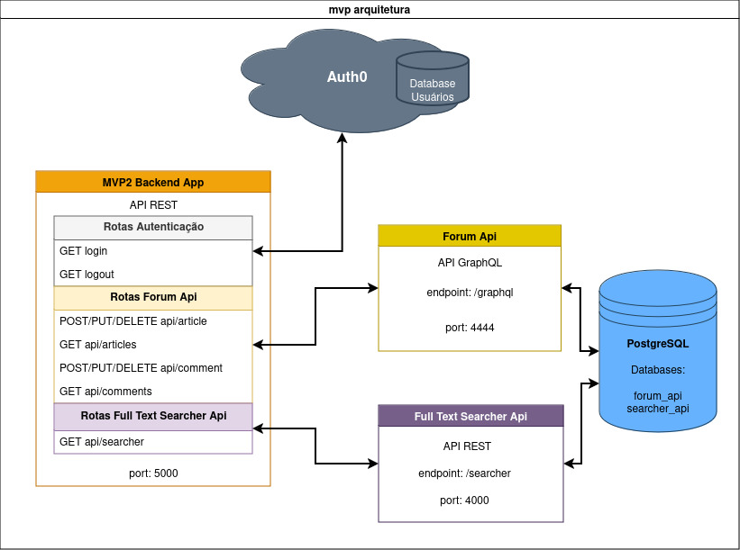

# MVP2 Backend APP


Projeto de MVP realizado para o curso de Pós graduação em Engenharia de Software da PUC-Rio - Pontifícia Universidade Católica do Rio de Janeiro.  


## Sumário

- [Objetivo](#objetivo)
- [Tecnologias](#tecnologias)
- [Arquitetura](#arquitetura)
- [Backend APP Integração](#backend-app-integração)
	- [Auth0](#auth0)
	- [Forum API](#forum-api)
	- [Full Text Searcher API](#full-text-searcher-api)
- [Configuração e Instalação](#configuração-e-instalação)
	- [Utilizando o Docker compose](#utilizando-o-docker-compose)
	- [Utilizando somente o Docker](#utilizando-somente-o-docker)
- [Endpoints](#endpoints)


## Objetivo

Com o objetivo de difundir o conhecimento aos direitos e deveres dos brasileiros, esse projeto vem a oferecer um pesquisador de texto completo para a Constituição Federal de 1988.  

Também oferece uma sessão de fórum para artigos e comentários, sendo assim uma troca de conhecimento entre os usuários.  

Esse projeto é um MVP e pretende evoluir para que, tanto o pesquisador de texto quanto a sessão de artigos, possam desenvolver novas funcionalidades que irão melhorar a busca de texto e ampliar a sessão do fórum, para que usuários possam trocar conhecimento respondendo a comentários existentes, inserir outros conteúdos além de texto.  

Esse é um sistema implementado em micro serviços, sendo esse componente chamado de `Mv2 Backend App` ser o componente principal que faz a integração com os demais componentes. A seguir é apresentado um fluxograma para apresentar a arquitetura e seus componentes.  


## Tecnologias

- [Python](https://www.python.org/)
- [Flask-openapi3](https://luolingchun.github.io/flask-openapi3/v3.x/)
- [Auth0](https://auth0.com/docs)
- [Authlib](https://docs.authlib.org/en/latest/)
- [Docker](https://docs.docker.com/)
- [Docker compose](https://docs.docker.com/compose/)

## Arquitetura

O sistema é composto por três APIs e um serviço externo (Auth0). São chamados de:
- MVP2_BACKEND_APP
- FULL_TEXT_SEARCHER_API
- FORUM_API
- Auth0 (serviço externo de Autenticação de usuários)

Os detalhes das APIs Full Text Searcher e Forum estão descritos em seus respectivos documentos. Sendo aqui apenas referenciados para melhor compreensão.  
O fluxograma a seguir apresenta as relações entre os componentes.



Também é utilizado um container postgres para o sistema de banco de dados. São necessários dois databases distintos. Um para o Forum API e outro para o Full Text Searcher API.  

Para o desenvolvimento é utilizado o Docker compose para orquestrar a construção e a inicialização dos containers de cada serviço. Mas caso for subir os serviços sem o Docker Compose, subir primeiro o container do postgres, pois ele será necessário para a inicialização do serviço de Full Text Searcher API. Na sessão de instalação há mais informação.  

Para a utilização do Docker Compose é importante ficar atento a estrutura de diretório a ser montada, para o docker compose fazer o build das imagens necessárias.

O arquivo `docker-compose.yml` incluído aqui nesse repositório segue as instruções para a seguinte estrutura de diretório: 

```
.
├── database/
├── forum_api/
├── full_text_searcher_api/
├── mvp2_backend_app/
|   ├── docs/
|   │   └── mvp2_fluxograma.jpg
|   ├── blueprint/
|   │   ├── __init__.py
|   │   ├── forum_bp.py
|   │   └── searcher_bp.py
|   ├── queries/
|   │   ├── __init__.py
|   │   ├── article_queries.py
|   │   └── comment_queries.py
|   ├── schemas/
|   |   ├── __init__.py
|   |   ├── common_schemas.py
|   |   ├── article_schemas.py
|   |   ├── comment_schemas.py
|   |   └── searcher_schemas.py
|   ├── app.py
|   ├── init_app.py
|   ├── logger.py
|   ├── Dockerfile
|   ├── requirements.txt
|   └── README.md
└── docker-compose.yml
```

O diretório `database` é criado através do Compose como volume do container do postgres. A estrutura dos diretórios dos serviços `forum api` e `full text searcher api` são apresentados em seus respectivos documentos.
O arquivo de docker compose deverá estar na raiz junto com os diretórios de todos os serviços. 

## Backend APP Integração

O serviço chamado de Backend App é considerado o componente principal por ter a responsabilidade de fazer a integração entre uma possível interface de usuário com os serviços de busca de texto completo e do fórum de artigos, além de fazer a conexão com o provedor de autenticação AuthO que também é o responsável pelo gerenciamento desses usuários.  
Sendo assim, esse é o componente que irá interligar os usuários aos conteúdos postados na sessão do fórum de artigos.


#### Auth0
Para a autenticação no APP é utilizado o provedor de autenticação Auth0.  
Quando o usuário acessa o endpoint `login` ele é redirecionado para o serviço Auth0, que fica responsável pela autenticação e o armazenamento dos dados de usuário.  
Com o usuário autenticado, o Auth0 retorna para o APP o token de acesso assim como os dados necessários do usuário. Esses dados são salvos no `session cookie` fornecido pelo Flask.  
Ao acessar o endpoint `logout` esses dados são removidos.  

Para a configuração necessária, é preciso ter as credenciais do Aplicativo criado na sua conta Auth0 conforme a [documentação](https://auth0.com/docs/get-started)  
São necessárias as seguintes variáveis de ambiente:  
```
AUTH0_CLIENT_ID: fornecidas pelo Auth0  
AUTH0_CLIENT_SECRET: fornecidas pelo Auth0  
AUTH0_DOMAIN: fornecidas pelo Auth0  
APP_SECRET_KEY: gerar uma chave aleatória de segurança. pode executar o comando `openssl rand -hex 32` no terminal para gerar uma chave segura. 
```

No arquivo `.env-example` possui as variáveis necessárias para o serviço do App.  

[!IMPORTANT]

Para as rotas que realizam alguma escrita no banco, é preciso informações do usuário, sendo necessário que este ainda esteja autenticado. A verificação se o usuário está autenticado é feita pelo session cookie. Para testes nessas rotas específicas é necessário inserir o session cookie retornado do Auth0 após uma autenticação, junto da requisição para a rota. 

Existe a variável de ambiente `DEV_ENV` que sendo configurada como True irá exibir esse session cookie retornado pelo Auth0 na rota home ("/") do APP.
Esse cookie pode ser utilizado para testar requisições específicas que necessitem de um usuário autenticado. Para isso utilize o Postman ou Insomnia, e acrescentá-lo pelo manage cookie. As informações necessárias para inserir esse session cookie no Postman ou Insomnia são:
- Domain = domain do container do APP (127.0.0.1)
- Path = /
- Expires = Opcional
- session = valor retornado pela autenticação  


#### Forum API
O serviço é uma Api GraphQL que apresenta artigos publicados pelos usuários.
No repositório do [Forum API](https://github.com/lucas-rodrigues0/forum_api) existe mais informação sobre o serviço.  
Para a Api do fórum de artigos é necessária a variável de ambiente com o endereço do respectivo container do serviço.  
```
FORUM_API_URL=http://forum-api:4444/graphql
```

#### Full Text Searcher API
O serviço é uma Api REST que realiza uma busca de texto completo em um documento PDF da Constituição Federal brasileira. O documento é indexado pela biblioteca python Whoosh.
No repositório do [Full Text Searcher API](https://github.com/lucas-rodrigues0/full_text_searcher_api) existe mais informação sobre o serviço.  
Para a Api do Searcher é necessária a variável de ambiente com o endereço do respectivo container do serviço.  
```
SEARCH_API_URL=http://searcher-api:4000
```


## Configuração e Instalação

As variáveis API_PORT e DEBUG são opcionais para o desenvolvimento. No App é sugerido utilizar a porta 5000, mas caso queira trocar, alterar esse valor pela  variável é possível, mas será necessário alterar as portas no Dockerfile e docker-compose para as portas serem expostas corretamente.
A variável Debug é para o desenvolvimento da aplicação Flask. É realizado o auto reload quando há alteração de código.

### Utilizando o Docker compose
É necessário ter instalado o [Docker](https://docs.docker.com/engine/install/) e o [Docker Compose](https://docs.docker.com/compose/install/) para subir os serviços automaticamente.  

O arquivo `docker-compose.yml` deverá ser movido para a raiz do projeto com a estrutura de diretórios de todos os serviços montada conforme descrito na seção [Arquitetura](#arquitetura). 

É necessário criar os arquivos `.env` para cada serviço. O arquivo `.env-example` pode ser copiado e preenchido com os valores corretos.

Execute o comando para fazer o build das imagens Docker e inicializar os container na ordem necessária.
```
docker compose up -d
```

Depois que subir todos os containers, pode acessar o endereço em seu navegador
```
http://127.0.0.1:5000/
```

### Utilizando somente o Docker

É necessário ter instalado o [Docker](https://docs.docker.com/engine/install/).

É necessário criar os arquivos `.env` para cada serviço. O arquivo `.env-example` pode ser copiado e preenchido com os valores corretos.

Para subir o ambiente sem o docker compose é importante criar uma network para que os serviços possam se conectar entre si.
Para criar uma network do tipo bridge com o nome de `app-network` execute o comando:
```
docker network create -d bridge app-network
```

Caso já tenha criado algum container, tipo o container db, e queira conectar esse container a network app-network, execute o comando:
```
docker network connect app-network db
```

Depois de criada a network, vamos subir um container com o banco postgres. O container terá o nome de 'db', estará conectado a network criada, a senha do postgres e o volume para a persistência dos dados.
execute os comandos:
```
docker pull postgres
docker run --name db --network app-network -e POSTGRES_PASSWORD=postgres -v ./database/postgres:/var/lib/postgresql/data -d postgres
```

Depois de iniciado o container do postgres podemos subir os outros containers em qualquer ordem.  
Para iniciar o serviço Backend APP, primeiro temos que fazer o build da imagem.
Estando no mesmo nível em que o Dockerfile do mvp2_backend_app se encontra, executar o comando:
```
docker build -t backend-app .
```
depois de construída a imagem podemos executar o container com o comando:
```
docker run --name backend-app -p 5000:5000 --network app-network -d backend-app
```
Para subir os outros serviços veja as informações em seus respectivos documentos.
Depois de subir os outros serviços da mesma forma, podemos testar o acesso pelo navegador.
```
http://127.0.0.1:5000/
```


## Endpoints

- #### GET /login
Autenticação com o Auth0

- #### GET /logout
Limpa a sessão com as informações do usuário

- #### GET /api/searcher?term=
Para a busca por termos no PDF da Constituição Federal. Acrescentar o(s) termo(s) para a busca no parâmetro `term`.

- #### GET /api/articles
Para a leitura de todos os artigos.

- #### GET /api/articles/id/<article_id>
Para a leitura de um artigo pelo seu ID.

- #### GET /api/articles/user/<user_id>
Para a leitura dos artigos de um usuário com o seu ID.

- #### GET api/articles/period?initialDate=<dd-mm-aaaa>&endDate=<dd-mm-aaaa>
Para a leitura dos artigos de um período. Os parâmetros `initialDate` e `endDate` devem ser strings no formato `dd-mm-aaaa`

- #### POST /api/article
Para a escrita de um novo artigo.
O corpo deve ser um JSON com os atributos necessários.
```
{
	"title": "string",
	"content": "string"
}
```
Os dados de usuário necessários para a escrita no banco são lidos do session cookie utilizado na autenticação.

- #### PUT /api/article/<article_id>
Para a atualização de um artigo com o ID indicado.
O corpo deve ser um JSON com os atributos opcionais. Pode atualizar somente o title, o content, ou os dois juntos.
```
{
	"title": "string",
	"content": "string"
}
```
Os dados de usuário necessários para a escrita no banco são lidos do session cookie utilizado na autenticação.
Somente o próprio usuário que criou o artigo é que pode atualizá-lo. Não é possível atualizar um artigo de outro usuário.

- #### DELETE /api/article/<article_id>
Para a remoção de um artigo com o ID indicado.
Os dados de usuário necessários para a escrita no banco são lidos do session cookie utilizado na autenticação.
Somente o próprio usuário que criou o artigo é que pode removê-lo. Ao remover um artigo, todos os comentários associados àquele artigo, também serão removidos, mesmo que seja comentário de outro usuário.

- #### GET /api/comments
Para a leitura de todos os comentários ao seus artigos.

- #### GET /api/articles/id/<article_id>
Para a leitura de um comentário pelo seu ID.

- #### GET /api/articles/user/<user_id>
Para a leitura dos comentários de um usuário com o seu ID.

- #### GET api/articles/period?initialDate=<dd-mm-aaaa>&endDate=<dd-mm-aaaa>
Para a leitura dos comentários de um período. Os parâmetros `initialDate` e `endDate` devem ser strings no formato `dd-mm-aaaa`

- #### POST /api/comment
Para a escrita de um novo comentário.
O corpo deve ser um JSON com os atributos necessário article_id e content. Os atributos de is_reply e comment_reply são opcionais. Eles indicam se o comentário é uma resposta a outro comentário, e sendo uma resposta, a qual comentário ele está respondendo.
```
{
	"article_id": "string",
	"content": "string"
    "is_reply": bool,
    "comment_reply": "string"
}
```
Os dados de usuário necessários para a escrita no banco são lidos do session cookie utilizado na autenticação.

- #### PUT /api/comment/<comment_id>
Para a atualização de um comentário com o ID indicado.
O corpo deve ser um JSON com o atributo necessário.
```
{
	"content": "string"
}
```
Os dados de usuário necessários para a escrita no banco são lidos do session cookie utilizado na autenticação.
Somente o próprio usuário que criou o comentário é que pode atualizá-lo. Não é possível atualizar um comentário de outro usuário.

- #### DELETE /api/comment/<comment_id>
Para a remoção de um comentário com o ID indicado.
Os dados de usuário necessários para a escrita no banco são lidos do session cookie utilizado na autenticação.
Somente o próprio usuário que criou o comentário é que pode removê-lo.